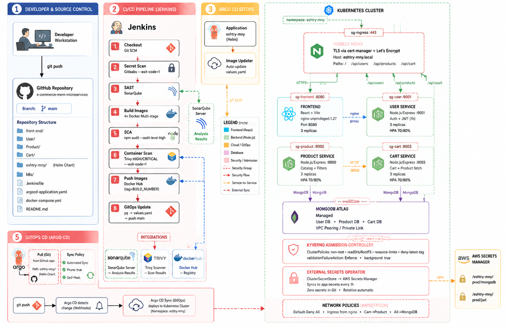
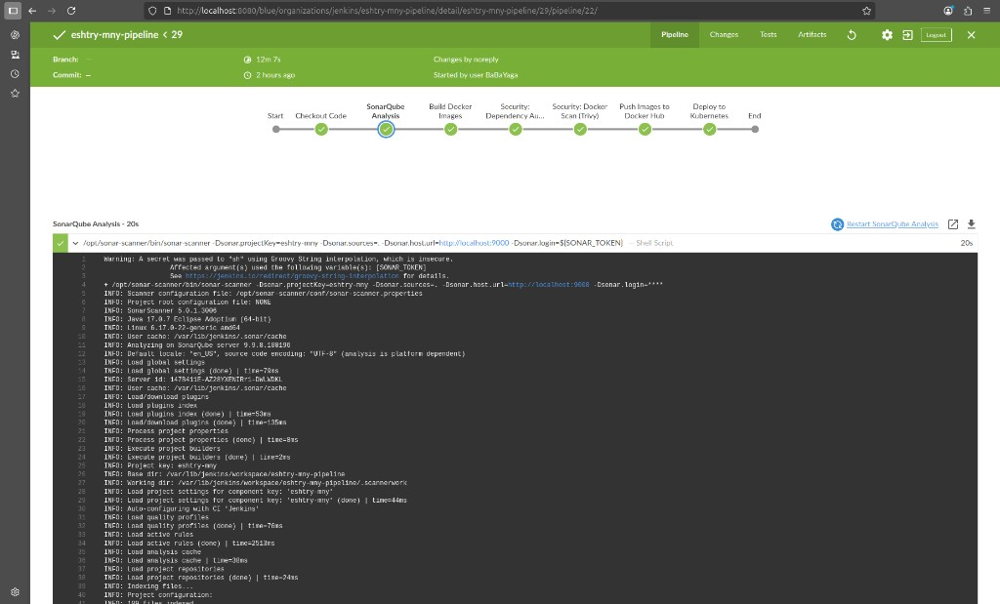
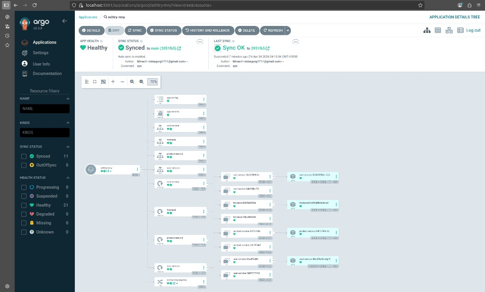
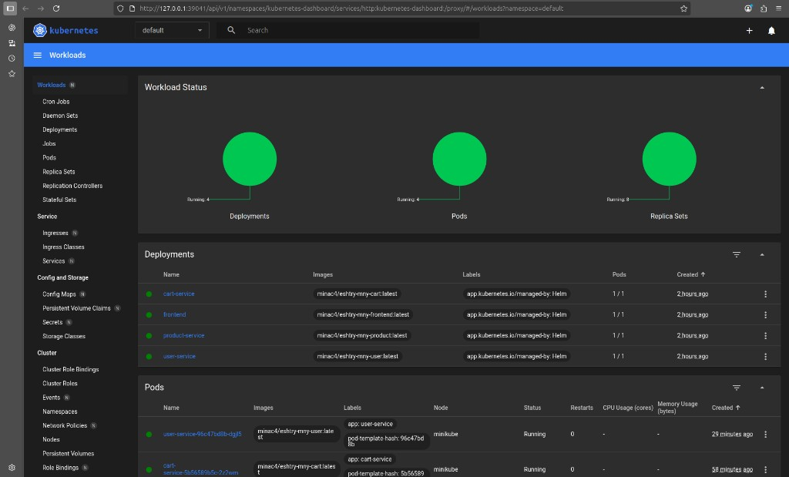

# Eshtry-Mny — MERN Microservices + DevSecOps + GitOps (Jenkins, SonarQube, Trivy, Helm, Argo CD)

## Architecture diagram




An e-commerce demo built as **MERN microservices** (Node.js/Express + MongoDB + React) and deployed to **Kubernetes** using **Helm**, with a **DevSecOps CI/CD pipeline** in **Jenkins** and **GitOps continuous delivery** via **Argo CD**.


## What's in this repo

### Application services

- **Frontend**: React (Vite) in `front-end/`, built into a static bundle and served by nginx (uses `nginxinc/nginx-unprivileged:1.27-alpine` running on container port `8080` with `emptyDir` volumes for `/var/cache/nginx` and `/tmp` so it works under Kubernetes' `readOnlyRootFilesystem: true` and `runAsNonRoot: true`). The frontend also proxies API calls to the three backend services via nginx, resolving upstream hostnames lazily per-request so it doesn't fail on startup if a backend isn't ready yet.
- **User service**: Node.js/Express in `User/` (API on `9001`)
- **Product service**: Node.js/Express in `Product/` (API on `9000`)
- **Cart service**: Node.js/Express in `Cart/` (API on `9003`)
- **Service communication**: Cart stores cart entries in MongoDB and fetches product details from Product over HTTP via `PRODUCT_SERVICE_URL`
- **Database**: MongoDB (Atlas in this setup)


### DevSecOps & GitOps

- **CI/CD**: `Jenkinsfile`
  - Static code analysis with **SonarQube**
  - Secret scanning with **gitleaks**
  - Dependency checks with **npm audit**
  - Container image scanning with **Trivy**, including a HIGH/CRITICAL-severity gate using `--exit-code 1`
  - Build + push images to **Docker Hub**
  - Update Helm image tags in `eshtry-mny/values.yaml` using `yq`, commit the build tag, and push `HEAD:main` for Argo CD to apply
- **Kubernetes**:
  - Raw manifests for reference in `k8s/base/`
  - Helm chart in `eshtry-mny/`
- **Argo CD**: GitOps application definition in `argocd-application.yaml`

## Repository structure 

```text
.
├─ Jenkinsfile
├─ docker-compose.yml
├─ argocd-application.yaml
├─ eshtry-mny/                 # Helm chart (templates + values)
├─ k8s/base/                  
├─ front-end/
├─ User/
├─ Product/
└─ Cart/
```

## CI/CD pipeline (DevSecOps)

The Jenkins pipeline in `Jenkinsfile` implements these stages:

- **Checkout Code**: fetch repository source
- **Security: Secret Scan (gitleaks)**: scans for leaked secrets with `--exit-code=1` (fails on any finding)
- **SonarQube Analysis**: runs `sonar-scanner` against the codebase (project key: `eshtry-mny`)
- **Build Docker Images**: builds images for `User`, `Product`, `Cart`, and `front-end`
- **Security: Dependency Audit**: runs `npm audit --audit-level=high` for each Node project (fails on HIGH/CRITICAL)
- **Security: Docker Scan (Trivy)**: scans each built image for **HIGH/CRITICAL** vulnerabilities with `--exit-code 1` (fails on findings)
- **Push Images to Docker Hub**: authenticates using Jenkins credentials and pushes versioned images (tag = Jenkins `BUILD_NUMBER`)
- **Update GitOps Manifest**: updates the `images.user`, `images.product`, `images.cart`, and `images.frontend` entries in `eshtry-mny/values.yaml` using `yq`, commits the build tag, and pushes `HEAD:main` for Argo CD to apply

Jenkins builds, scans, and publishes the images, then records the new image tags in git. It does not run `helm upgrade --install` against the live cluster.

## GitOps delivery with Argo CD

`argocd-application.yaml` defines an Argo CD `Application` named `eshtry-mny` that:

- Pulls the Helm chart from `https://github.com/MinaC4/Eshtry-Mny-Mern-Microservices-DevSecOps.git` at the repo path `eshtry-mny/`
- Deploys into the `eshtry-mny` namespace
- Uses **automated sync** with:
  - **prune**: removes deleted manifests
  - **selfHeal**: reconciles drift automatically
- **Argo CD Image Updater** annotations on the Application (see `argocd-application.yaml`) automatically update image tags in `values.yaml` and commit back to git — Jenkins only builds and pushes images.

Argo CD is the only component that applies Kubernetes changes to the cluster. After Jenkins pushes updated image tags, Argo CD detects the committed Helm values change and syncs it automatically.

## Kubernetes + Helm deployment

### Helm chart

The Helm chart in `eshtry-mny/` templates:

- Deployments + Services for **user**, **product**, **cart**, and **frontend**
- A shared `ConfigMap` (`app-config`) for non-secret settings
- A shared `Secret` (`app-secrets`) for sensitive settings (populated via **External Secrets Operator** from AWS Secrets Manager)
- A dedicated `eshtry-mny` namespace
- Health probes and resource requests/limits on all backend deployments
- Container `securityContext` settings with `runAsNonRoot: true`, `readOnlyRootFilesystem: true`, and `allowPrivilegeEscalation: false`
- **Pod Anti-Affinity** (soft) to spread pods across nodes
- **RollingUpdate** strategy with `maxUnavailable: 0` for zero-downtime deployments
- **HorizontalPodAutoscaler** (CPU 70%, Memory 80%, min 3 / max 10 replicas)
- **PodDisruptionBudget** (`minAvailable: 1`) for high availability during maintenance
- **NetworkPolicies**: default deny-all, with explicit allow rules per service (Ingress from nginx, service-to-service, egress to MongoDB)
- An `Ingress` that routes:
  - `/` → frontend
  - `/api/users` → user service
  - `/api/products` → product service
  - `/api/cart` → cart service
- **TLS termination** via cert-manager + Let's Encrypt (annotation on Ingress)

`k8s/base/configmap.yaml`, `k8s/base/secret.yaml` and `eshtry-mny/values.yaml` ship with `CHANGE_ME` placeholders only. For Helm, pass real values with `--set` or configure **External Secrets Operator** (see `eshtry-mny/templates/externalsecret.yaml` + `clustersecretstore.yaml`). `NOTE.md` keeps the reminder to rotate any credentials that were previously committed before making the repo public.

Backends restrict CORS to `FRONTEND_ORIGIN` from the environment, which defaults to `http://localhost:5173` as shown in `.env.example`.

### Admission Control (Kyverno)

Cluster policies in `eshtry-mny/templates/kyverno-policies.yaml` enforce:

- `runAsNonRoot: true` on all containers
- `readOnlyRootFilesystem: true` on all containers
- CPU/memory requests and limits required
- Image tag `:latest` rejected

### Example install/upgrade

From the repo folder:

```bash
cd eshtry-mny
helm upgrade --install eshtry-mny . -n eshtry-mny --create-namespace
```

## Quickstart (one command)

Clone the repo and run the setup script for your platform:

**macOS / Linux:**
```bash
./scripts/setup-mac.sh
```

**Windows (PowerShell):**
```powershell
powershell -ExecutionPolicy Bypass -File scripts\setup-windows.ps1
```

The script will:

1. Check Docker is installed and running
2. Prompt for MongoDB Atlas credentials (if `.env` doesn't exist)
3. Build and start all services
4. Wait for backends to pass health checks
5. Print URLs for frontend and APIs

After setup, access the app at http://localhost:5173

To stop: `docker compose down`

## Manual setup (advanced)

If you prefer manual control:

1. Copy `.env.example` to `.env` and fill in your MongoDB Atlas credentials.
2. Run `docker compose up --build`

Ports:

- `5173` → frontend
- `9001` → user service
- `9000` → product service
- `9003` → cart service

All four services build from multi-stage Dockerfiles. The backend images run in production mode as non-root users with `node server.js`; the frontend image also runs as a non-root user and serves the built static bundle with nginx.

## Tooling screenshots

### MongoDB Atlas (documents)


### MongoDB Atlas (data model diagram)


### Jenkins pipeline run (stages)



### SonarQube project overview 


### SonarQube issues list


### SonarQube security hotspot review


### Argo CD application tree (synced/healthy)



### Kubernetes Dashboard (workloads overview)



### Kubernetes Dashboard (replica sets/services)


