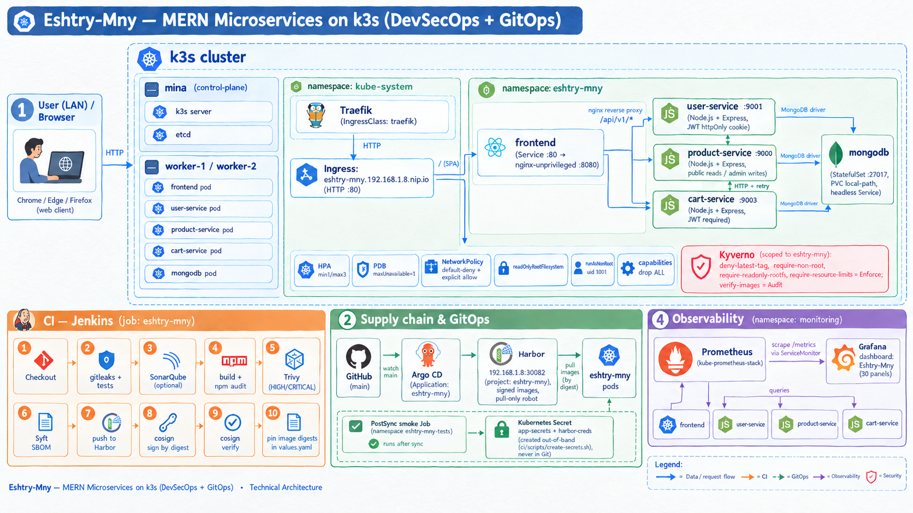

# Eshtry-Mny — MERN Microservices on k3s (DevSecOps + GitOps)

An e-commerce demo built as **MERN microservices** (Node.js/Express + MongoDB + React) and run on a
self-hosted **k3s** homelab with a full **DevSecOps supply chain**: Jenkins CI → Harbor (signed,
digest-pinned images) → Git → Argo CD → Kyverno admission, plus Prometheus/Grafana monitoring.

**Live app:** http://eshtry-mny.192.168.1.8.nip.io



> This repository started from a cloud reference design (Docker Hub, AWS Secrets Manager, ingress-nginx,
> MongoDB Atlas). It has been adapted to the operator's real homelab; see
> [`docs/COMPARISON.md`](docs/COMPARISON.md) for the full received-vs-delivered diff and
> [`docs/01-ADR-0001-homelab-adaptation.md`](docs/01-ADR-0001-homelab-adaptation.md) for the decisions.

## Services

| Service | Path | Runtime | Port | Notes |
|---|---|---|---|---|
| frontend | `front-end/` | React 18 + Vite, served by `nginx-unprivileged` | 8080 (container) / 80 (Service) | proxies `/api/v1/*`, SPA fallback |
| user-service | `User/` | Node 20 / Express | 9001 | bcrypt, JWT httpOnly cookie, register/login/logout/profile |
| product-service | `Product/` | Node 20 / Express | 9000 | public reads, admin-only writes, filters |
| cart-service | `Cart/` | Node 20 / Express | 9003 | JWT required; calls product-service |
| mongodb | in-cluster StatefulSet | MongoDB 7 | 27017 | dedicated, `local-path` PVC, not exposed |

All three backends share: `helmet`, CORS locked to `FRONTEND_ORIGIN`, two-tier rate limiting,
centralized error handling, Zod validation, pino logging, `/health` (liveness) and `/ready`
(readiness gated on MongoDB), and Prometheus `/metrics`.

## What runs on the homelab

- **Ingress:** Traefik (class `traefik`, `kube-system`) — not ingress-nginx.
- **Database:** in-cluster MongoDB StatefulSet in `eshtry-mny` (no Atlas); NetworkPolicy egress is
  restricted to the Mongo pods only.
- **Secrets:** a local Kubernetes Secret created out-of-band by
  [`ci/scripts/create-secrets.sh`](ci/scripts/create-secrets.sh) and never committed. The chart does
  not render it, so Argo CD never reverts/prunes it. (The cluster's ESO↔Vault wiring is non-functional,
  so ESO is gated off.)
- **Registry:** the operator's **Harbor** at `192.168.1.8:30082/eshtry-mny` (project-scoped robots;
  pull-only for the cluster, push for CI).
- **Delivery:** **Argo CD** is the deployer of record (auto-sync, `prune`, `selfHeal`); manual
  `helm upgrade` is retired.
- **Scale:** HPA min 1 / max 3; PDB `maxUnavailable: 1`.

## CI/CD pipeline (Jenkins)

[`Jenkinsfile`](Jenkinsfile) — job `eshtry-mny`, triggered by the Jenkins API (no webhook; Jenkins is
LAN-only). Stages:

1. **Checkout Code**
2. **Quality & Tests** — gitleaks (blocking secret scan) + `npm test` for the three backends
3. **SonarQube Analysis** — optional (`SONAR_ENABLED`), containerised scanner
4. **Build & Dependency Audit** — build 4 images + `npm audit --omit=dev --audit-level=high`
5. **Security: Docker Scan (Trivy)** — HIGH/CRITICAL blocking, shared offline DB cache
6. **Supply Chain: SBOM (Syft)** — CycloneDX JSON per image, archived
7. **Registry Login & Push** — Harbor robot
8. **Supply Chain: Sign & Verify (cosign)** — key-based, **by digest**
9. **Helm Lint & Template**
10. **Update GitOps Manifest** — pins image **digests** into `eshtry-mny/values.yaml` and pushes

## GitOps (Argo CD)

[`argocd-application.yaml`](argocd-application.yaml) defines `Application eshtry-mny` pointing at this
repo (`main`, path `eshtry-mny`) with automated sync + self-heal + prune. A **PostSync smoke Job**
walks `/ → register → login → add-to-cart → checkout` through the Ingress after each sync.

## Security controls

- **App:** bcrypt, JWT (HS256, explicit algorithm) in httpOnly/SameSite=Strict cookies, Zod validation
  (including catalog filters), RBAC (`requireRole('admin')`), rate limiting, fail-fast DB access.
- **Container/K8s:** non-root numeric UID, `readOnlyRootFilesystem`, `capabilities.drop: [ALL]`,
  `seccompProfile: RuntimeDefault`, `allowPrivilegeEscalation: false`, probes, resources, anti-affinity.
- **Supply chain:** private Harbor, SBOM, cosign signing/verification, digest pinning, Trivy = 0
  HIGH/CRITICAL, gitleaks.
- **Network:** default-deny NetworkPolicies; each service reaches only DNS, MongoDB, and its peers
  (enforcement proven — see [`docs/09-network-security.md`](docs/09-network-security.md)).
- **Admission (Kyverno, scoped to `eshtry-mny`):** `deny-latest-tag`, `require-non-root`,
  `require-readonly-rootfs`, `require-resource-limits` (Enforce) and `verify-images` (**Audit** — see
  [`docs/08-policy-as-code.md`](docs/08-policy-as-code.md) for why Enforce is blocked on this cluster).

Full list: [`docs/SECURITY.md`](docs/SECURITY.md).

## Observability

Backends expose `/metrics` (prom-client). A `ServiceMonitor` is scraped by the existing
kube-prometheus-stack; the **Grafana dashboard `Eshtry-Mny`** (30 panels: overview stats, golden
signals, latency percentiles, HPA/replicas, pod resources, network, nodes, health) is provisioned from
[`eshtry-mny/dashboards/eshtry-mny.json`](eshtry-mny/dashboards/eshtry-mny.json).

Grafana: `http://192.168.1.8:30084` (credentials in secret `prometheus-grafana`, namespace `monitoring`).

## Repository structure

```text
.
├─ Jenkinsfile                 # extended CI pipeline (Harbor, SBOM, cosign, digest pin)
├─ argocd-application.yaml     # Argo CD Application
├─ docker-compose.yml          # local dev
├─ eshtry-mny/                 # Helm chart (templates + values + dashboards/)
├─ ci/                         # services.yaml + scripts (sbom/sign/verify/create-secrets)
├─ tests/smoke/                # smoke-test script (run by the Argo PostSync Job)
├─ security/cosign.pub         # public key used for image verification
├─ docs/                       # analysis, threat model, ADR, phase reports, SECURITY/EVIDENCE/DEMO
├─ front-end/                  # React + Vite (nginx-unprivileged)
├─ User/  Product/  Cart/      # Express microservices
├─ k8s/base/                   # non-canonical reference manifests (not deployed from)
└─ products.json               # Product-collection seed data (26 docs)
```

## Run locally (docker-compose)

```bash
cp .env.example .env            # fill MongoDB credentials
docker compose up --build       # frontend :5173, user :9001, product :9000, cart :9003
```

## Deploy / verify on the homelab

Deployment is GitOps-only: change the chart or the Jenkins digest pin and push; Argo CD syncs.

```bash
kubectl get application eshtry-mny -n argocd     # Synced / Healthy
kubectl get pods -n eshtry-mny                   # 5/5 Running
kubectl logs -n eshtry-mny-tests job/smoke-test  # SMOKE OK
```

Images are pulled from Harbor; `values.yaml` references them **by digest**.

## API (through the Ingress)

| Method | Path | Auth |
|---|---|---|
| POST | `/api/v1/users` | public (register) |
| POST | `/api/v1/users/login` / `/logout` | public |
| GET | `/api/v1/users` | JWT (profile) |
| GET | `/api/v1/products` · `/api/v1/products/:idOrName` | public |
| POST | `/api/v1/products` | JWT + admin |
| GET | `/api/v1/filter/category/:c` · `/price/:p` · `/categoryprice/:c&&:p` | public |
| GET/POST/DELETE | `/api/v1/cart` · `/api/v1/cart/:productid` · `/api/v1/cart/checkout` | JWT |

## Documentation

- [`docs/SECURITY.md`](docs/SECURITY.md) — controls → threat → verification
- [`docs/EVIDENCE.md`](docs/EVIDENCE.md) — indexed evidence bundle
- [`docs/COMPARISON.md`](docs/COMPARISON.md) — received vs delivered
- [`docs/DEMO.md`](docs/DEMO.md) — end-to-end walkthrough
- [`docs/GAP-ANALYSIS.md`](docs/GAP-ANALYSIS.md) — what is done vs remaining
- [`docs/STATE.md`](docs/STATE.md) — current state and resume point
- `docs/0x-*.md` + `docs/phases/` — per-phase analysis and reports

## Screenshots (tooling)

### Jenkins pipeline


### Argo CD application (synced/healthy)


### Kubernetes workloads


## Honest limitations

- **HTTP only** on the LAN (no TLS); auth cookie `secure` is therefore disabled for the HTTP origin.
- **Kyverno `verify-images` is in Audit**, not Enforce: Kyverno 1.18.2 rejects a bearer realm served by
  a private IP (Harbor here). CI `cosign verify` is the enforced signature gate.
- **Local Kubernetes Secret** instead of Vault/ESO (the cluster's ESO↔Vault wiring is broken).
- No Falco runtime detection; ZAP DAST not yet run; branch protection on `main` not enabled.
