# Architecture diagram — prompt (matches the current project state)

Use this to regenerate the architecture diagram so it reflects what actually runs on the homelab.
Two options: an **image-generation prompt** (for DALL·E/Midjourney/etc.) and a **Mermaid** version
(exact, no text distortion — best for draw.io / mermaid.live / `mermaid-cli`).

## Option A — Image-generation prompt

```
Create a clean, modern, flat-style technical architecture diagram for a MERN microservices
e-commerce project named "Eshtry-Mny" deployed on a self-hosted k3s homelab. 16:9, light
background (#F7F9FC), subtle grid, rounded rectangles with soft shadows, thin connector lines
with arrowheads, a small legend, and a title top-left: "Eshtry-Mny — MERN Microservices on k3s
(DevSecOps + GitOps)". Render ALL text exactly as written below, no typos, no extra words.

LAYOUT (left to right = request/data flow; bottom band = CI/CD, GitOps and Observability):

[1] Far left, a laptop/globe icon labeled "User (LAN) / Browser".

[2] Big rounded boundary labeled "k3s cluster" containing two node boxes:
    "mina (control-plane)" and "worker-1 / worker-2". Put pods on nodes as small chips.

[3] Inside the cluster, a boundary "namespace: kube-system" with a box
    "Traefik (IngressClass: traefik)".

[4] A large boundary "namespace: eshtry-mny" containing:
    - "Ingress: eshtry-mny.192.168.1.8.nip.io (HTTP :80)" just below Traefik.
    - "frontend (Service :80 -> nginx-unprivileged :8080)" with a small React logo.
    - "user-service :9001" (Node.js + Express, JWT httpOnly cookie)
    - "product-service :9000" (Node.js + Express, public reads / admin writes)
    - "cart-service :9003" (Node.js + Express, JWT required)
    - "mongodb (StatefulSet :27017, PVC local-path, headless Service)"
    - Around the pods, small badges: "HPA min1/max3", "PDB maxUnavailable=1",
      "NetworkPolicy: default-deny + explicit allow", "readOnlyRootFilesystem",
      "runAsNonRoot uid 1001", "capabilities drop ALL".
    - A small shield icon labeled "Kyverno (scoped to eshtry-mny): deny-latest-tag,
      require-non-root, require-readonly-rootfs, require-resource-limits = Enforce;
      verify-images = Audit".

ARROWS (label each):
 - "User" -> "Traefik" : "HTTP"
 - "Traefik" -> "Ingress" -> "frontend" : "/ (SPA)"
 - "Traefik" -> "user-service / product-service / cart-service" : "/api/v1/*"
 - "frontend" -> "user-service :9001", "product-service :9000", "cart-service :9003" :
   "nginx reverse proxy /api/v1/*"
 - "cart-service" -> "product-service :9000" : "HTTP + retry"
 - "user-service", "product-service", "cart-service" -> "mongodb :27017" : "MongoDB driver"

BOTTOM BAND (drawn as three clearly separated lanes):

Lane A "CI — Jenkins (job: eshtry-mny)" with numbered stages left to right:
"1 Checkout", "2 gitleaks + tests", "3 SonarQube (optional)", "4 build + npm audit",
"5 Trivy (HIGH/CRITICAL)", "6 Syft SBOM", "7 push to Harbor", "8 cosign sign by digest",
"9 cosign verify", "10 pin image digests in values.yaml".

Lane B "Supply chain & GitOps":
 - "GitHub (main)" repository icon on the left.
 - "Harbor registry 192.168.1.8:30082 (project: eshtry-mny), signed images, pull-only robot".
 - "Argo CD (Application: eshtry-mny)" in the middle; arrow "GitHub main" -> "Argo CD"
   labeled "watch main"; arrow "Harbor" -> "eshtry-mny pods" labeled "pull images (by digest)".
 - "Argo CD" -> "namespace eshtry-mny" labeled "Helm sync + self-heal + prune".
 - A small "PostSync smoke Job (namespace eshtry-mny-tests)" box with arrow from Argo CD
   labeled "runs after sync" and arrow to the app labeled "register/login/cart/checkout".
 - A "Kubernetes Secret: app-secrets + harbor-creds" box with a dashed arrow labeled
   "created out-of-band (ci/scripts/create-secrets.sh), never in Git".

Lane C "Observability (namespace: monitoring)":
 - "Prometheus (kube-prometheus-stack)" with arrow from the backends labeled
   "scrape /metrics via ServiceMonitor".
 - "Grafana dashboard: Eshtry-Mny (30 panels)" with arrow from Prometheus labeled "queries".

STYLE RULES:
 - Use official-ish logos: Docker, Kubernetes, GitHub, Jenkins, Harbor, Argo CD, Kyverno,
   Prometheus, Grafana, MongoDB, nginx, Node.js, React.
 - Color-code: data flow = blue arrows, CI = orange, GitOps = green, observability = purple,
   security badges = red.
 - Keep boxes aligned on a grid; do not overlap; keep all text horizontal and legible.
 - Add a legend box bottom-right listing the arrow colors.
 - Do NOT invent components (no cloud services, no AWS, no Atlas, no ingress-nginx, no Kafka).
```

## Option B — Mermaid (exact)

```mermaid
flowchart LR
  U["User / Browser (LAN)"] -->|HTTP| T["Traefik (IngressClass: traefik)<br/>namespace: kube-system"]
  T -->|"/ (SPA)"| I["Ingress: eshtry-mny.192.168.1.8.nip.io :80"]
  I --> FE["frontend :80 → nginx-unprivileged :8080"]
  T -->|"/api/v1/*"| API["user-service :9001<br/>product-service :9000<br/>cart-service :9003"]
  FE -->|"nginx reverse proxy /api/v1/*"| API
  CART["cart-service :9003"] -->|"HTTP + retry"| PROD["product-service :9000"]
  API -->|"MongoDB driver :27017"| MONGO["mongodb StatefulSet<br/>PVC local-path (headless Service)"]

  subgraph CI["CI — Jenkins job: eshtry-mny"]
    direction LR
    J1["1 Checkout"] --> J2["2 gitleaks + tests"] --> J3["3 SonarQube (optional)"]
    J3 --> J4["4 build + npm audit --omit=dev"] --> J5["5 Trivy HIGH/CRITICAL"]
    J5 --> J6["6 Syft SBOM"] --> J7["7 push to Harbor"] --> J8["8 cosign sign (by digest)"]
    J8 --> J9["9 cosign verify"] --> J10["10 pin digests in values.yaml"]
  end

  subgraph SC["Supply chain & GitOps"]
    GH["GitHub (main)"]
    HAR["Harbor 192.168.1.8:30082<br/>project: eshtry-mny<br/>signed images (robots)"]
    ARGO["Argo CD Application: eshtry-mny<br/>auto-sync + self-heal + prune"]
    SMOKE["PostSync smoke Job<br/>namespace: eshtry-mny-tests"]
    SEC["Secret app-secrets + harbor-creds<br/>(created out-of-band, never in Git)"]
    GH -.->|"watch main"| ARGO
    ARGO -->|"Helm sync"| API
    HAR -->|"pull images by digest"| API
    J7 --> HAR
    J10 --> GH
    ARGO -->|"runs after sync"| SMOKE
    SMOKE -->|"register/login/cart/checkout"| FE
    SEC -.->|"env / imagePullSecret"| API
  end

  subgraph OBS["Observability — namespace: monitoring"]
    PROM["Prometheus (kube-prometheus-stack)"]
    GRAF["Grafana: dashboard Eshtry-Mny (30 panels)"]
    API -.->|"scrape /metrics via ServiceMonitor"| PROM
    PROM -->|"queries"| GRAF
  end

  subgraph KYV["Admission — Kyverno (scoped to eshtry-mny)"]
    K1["Enforce: deny-latest-tag · require-non-root · require-readonly-rootfs · require-resource-limits"]
    K2["Audit: eshtry-verify-images (cosign public key)"]
  end
  KYV -.->|"validate pods"| API

  classDef flow fill:#e6f0ff,stroke:#3b82f6,color:#0b2a5b;
  classDef ci fill:#fff2e6,stroke:#f59e0b,color:#7a3d00;
  classDef gitops fill:#e9f9ef,stroke:#22c55e,color:#0b4d24;
  classDef obs fill:#f3e8ff,stroke:#a855f7,color:#4c1d95;
  classDef sec fill:#fde8e8,stroke:#ef4444,color:#7f1d1d;
  class U,T,I,FE,API,CART,PROD,MONGO flow;
  class J1,J2,J3,J4,J5,J6,J7,J8,J9,J10 ci;
  class GH,HAR,ARGO,SMOKE,SEC gitops;
  class PROM,GRAF obs;
  class K1,K2 sec;
```



> Image generators distort long/technical labels; for exact output prefer the Mermaid version
> rendered with `mermaid-cli` (`mmdc -i docs/architecture-diagram-prompt.md ...`) or draw.io.
